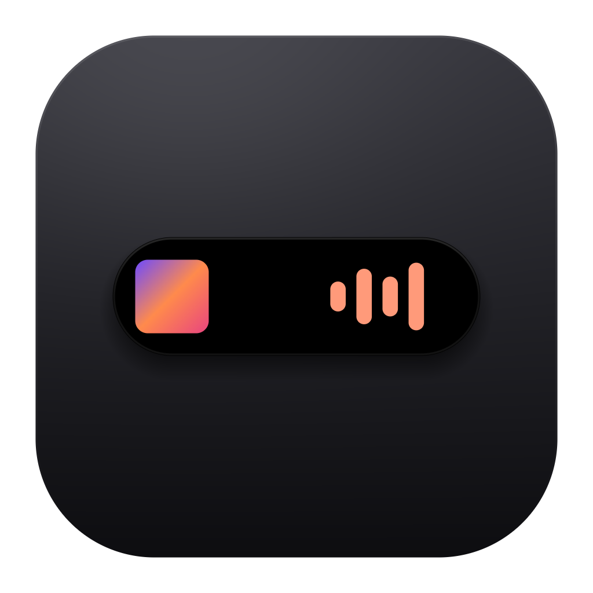
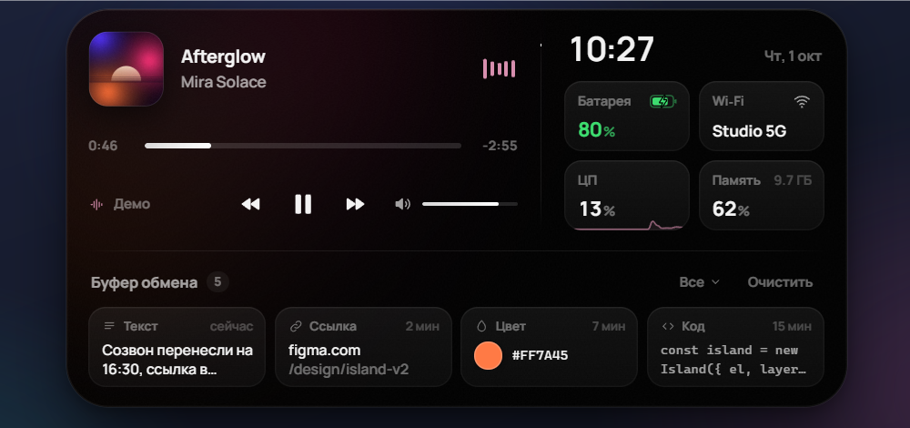
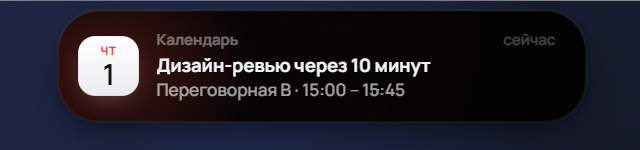

<p align="center">
  
</p>

<h1 align="center">Island</h1>

<p align="center">
  Dynamic Island для Windows — плавающая капсула по центру верхнего края экрана<br>
  с музыкой, историей буфера обмена, системными статусами и уведомлениями.
</p>

<p align="center">
  <a href="https://github.com/ctrla1/island/releases/latest"><b>⬇ Скачать для Windows</b></a>
</p>

<p align="center">
  
</p>

В покое остров — почти незаметная чёрная капсула. При наведении он пружинно раскрывается
в компактную панель, а уведомления и live-активности (зарядка, громкость, «скопировано»,
смена трека) временно меняют его форму и сами сворачиваются обратно.

<p align="center">
  
  &nbsp;
  
</p>

## Установка

1. Скачайте `Island-Setup-x.y.z.exe` со страницы [Releases](https://github.com/ctrla1/island/releases/latest).
2. Запустите установщик — он поставит Island для текущего пользователя (права администратора не нужны) и сразу запустит его.
3. Остров появится вверху экрана, иконка — в трее. Island сам запускается при входе в Windows; это отключается в меню трея.

> **Windows SmartScreen.** Установщик не подписан сертификатом, поэтому при первом запуске Windows может показать
> «Система Windows защитила ваш компьютер». Нажмите **Подробнее → Выполнить в любом случае**.

Удаление — через «Параметры → Приложения» как у любой программы.

Требования: Windows 10/11 x64.

## Что умеет

| Модуль | Что показывает |
|---|---|
| **Now Playing** | трек из системной медиасессии Windows (Spotify, Яндекс Музыка, браузеры, Media Player…): обложка, артист, прогресс с перемоткой, play/pause/next/prev |
| **Громкость** | системная громкость: слайдер, колесо мыши над островом, индикатор при изменении с клавиатуры |
| **Буфер обмена** | последние скопированные тексты, ссылки, цвета, код, почта, изображения; клик — скопировать снова. История хранится только в памяти, а содержимое, помеченное менеджерами паролей как секретное, в неё не попадает |
| **Quick Info** | время, батарея, сеть, загрузка ЦП с графиком, память |
| **Уведомления** | компактные карточки, которые сами исчезают; свои уведомления можно отправлять из скриптов (см. ниже) |

### Управление

- **Наведение** — над рабочим столом остров раскрывается сразу. Если под ним открыто приложение (например,
  браузер со вкладками), капсула становится прозрачной и пропускает клики к нему, так что вкладки остаются
  доступны; **задержите курсор на ~2 секунды** без клика — остров проявится и раскроется
- Курсор ушёл — остров свернётся через мгновение; **Esc** — свернуть сразу
- **Колесо мыши** над раскрытым островом — громкость (с Shift — точнее)
- **Ctrl+Alt+I** или клик по иконке в трее — закрепить раскрытым
- **Ctrl+Alt+N** — показать демо-уведомление
- **Меню трея** — индикаторы, пропуск кликов сквозь капсулу (если выключить, остров раскрывается сразу
  при наведении), скрытие в играх, автозапуск, выход

### Игры и полноэкранные приложения

Когда основной монитор занят игрой (borderless или эксклюзивный полноэкранный режим),
видео на весь экран или презентацией, остров полностью скрывается: он не рисуется поверх
и не реагирует на курсор у верхнего края. Обычные развёрнутые окна на это не влияют.
Уведомления, пришедшие во время игры, показываются после выхода из неё, если им не больше минуты.

### Свои уведомления

Island слушает локальный эндпоинт — удобно для сборок, ботов, скриптов:

```bash
curl -X POST http://127.0.0.1:47800/notify -H "Content-Type: application/json" -d "{\"app\":\"Build\",\"title\":\"Сборка готова\",\"body\":\"Все тесты зелёные\",\"icon\":\"build\",\"color\":\"#34c759\"}"
```

Поля: `app`, `title`, `body`, `icon` (`messages`, `mail`, `calendar`, `reminders`, `box`, `bell`, `build`), `color` (`#rrggbb`).
Эндпоинт слушает только `127.0.0.1` и принимает только `application/json`.

### Режим для записи видео

`Island.exe --demo` (или `npm run demo` из исходников) показывает демо-трек со сгенерированной обложкой,
примеры в буфере обмена и нейтральное имя сети — чтобы на записи не было ничего личного.

## Сборка из исходников

```bash
npm install
npm start        # запустить
npm run dist     # собрать установщик в dist/
```

Нужны Node.js 18+ и Windows 10/11.

```
src/
  main/            главный процесс Electron: окно-оверлей, click-through, трей, хоткеи
    bridge.js      супервизор PowerShell-моста
    clipboard.js   история буфера обмена
    system.js      ЦП / память / питание
    win32.js       привязки к user32/kernel32/shell32 через koffi (буфер, питание, полноэкранные приложения)
  bridge/
    system-bridge.ps1   медиасессия (WinRT), громкость (Core Audio), сеть
  renderer/
    js/island.js   машина состояний и пружинный морф формы
    js/spring.js   физика пружин и CSS-easing из пружины
    js/…           модули: nowplaying, clipboard, quickinfo, notifications, equalizer
```

Форма острова анимируется настоящими пружинами — ширина, высота и радиус независимо,
поэтому она «перетекает», а не растягивается. Обложка альбома — один элемент, который
вырастает из капсулы в карточку. Эквалайзер работает на ограниченной частоте кадров,
а без музыки остров почти не потребляет ресурсов.

## Лицензия

[MIT](LICENSE)
